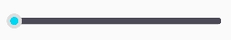
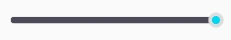
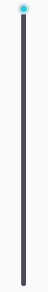
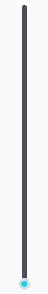

# ProgressView 进度条

## 效果图

- 横向进度条-左



- 横向进度条-右



- 竖向进度条-上



- 竖向进度条-下



## 布局文件

```xml
<com.i56s.ktlib.views.ProgressView
    android:id="@+id/progress"
    android:layout_width="wrap_content"
    android:layout_height="match_parent"
    android:gravity="start"
    android:max="100"
    android:orientation="horizontal"
    android:progress="20"
    android:thumb="@drawable/progress_thumb"
    app:isDraggable="true"
    app:progressBackgroundColor="#4b4a56"
    app:progressColor="#00d7f2"
    app:progressWidth="@dimen/dp_10" />
```

## 属性说明

属性名 | 说明      | 默认值     | 可选
--- |---------|---------| ---
android:gravity | 位置      | start   | start、end、left、right、top、bottom
android:max | 进度条最大值  | 100    | 0-x
android:orientation | 朝向      | horizontal | horizontal、vertical   
android:progress | 当前进度    | 0 | 小于等于max最大值
android:thumb | 滑块      | @drawable/progress_thumb |  可为@null(不显示滑块)
isDraggable | 是否可拖动   | true | true、false
progressBackgroundColor | 进度条背景颜色 | #4b4a56 | 颜色值 
progressColor | 进度颜色 | #00d7f2 | 颜色值 
progressWidth | 进度条宽度 | 10dp | 数值

## 监听

```kotlin
//进度变化监听
progress.setOnProgressChangeListener { progress, view ->
    Log.d("当前进度", "progress = $progress")
}
```

## 内置默认属性(可覆盖)

```xml
<style name="ProgressView">
    <item name="android:orientation">horizontal</item>
    <item name="android:max">100</item>
    <item name="isDraggable">true</item>
    <item name="progressBackgroundColor">#4b4a56</item>
    <item name="progressColor">#00d7f2</item>
    <item name="progressWidth">@dimen/dp_10</item>
    <item name="android:thumb">@drawable/progress_thumb</item>
</style>
```