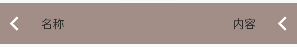

# SettingItemView 设置条纹栏控件

### 标题控件继承自 ConstraintLayout 布局，可自由添加所需控件

## 效果图



## 布局文件

- 基本使用

```xml
<com.i56s.ktlib.views.SettingItemView
    android:layout_width="match_parent"
    android:layout_height="@dimen/dp_50"
    android:background="#aa9991"
    app:sContent="内容"
    app:sImgLeftSrc="@drawable/ic_title_view_back"
    app:sImgRightSrc="@drawable/ic_title_view_back"
    app:sName="名称" />
```

- 添加控件

```xml
<com.i56s.ktlib.views.SettingItemView
    android:layout_width="match_parent"
    android:layout_height="@dimen/dp_50"
    android:background="#aa9991"
    app:sImgLeftSrc="@drawable/ic_title_view_back"
    app:sName="名称">

    <TextView
        android:layout_width="wrap_content"
        android:layout_height="wrap_content"
        android:layout_marginEnd="@dimen/dp_15"
        android:text="菜单"
        app:layout_constraintBottom_toBottomOf="parent"
        app:layout_constraintEnd_toEndOf="parent"
        app:layout_constraintTop_toTopOf="parent" />
</com.i56s.ktlib.views.SettingItemView>
```

## 自定义属性说明

xml属性 | 代码属性  | 说明                | 默认值
--- |-------|-------------------| ---
sName | name | 名称（左边文本           | 无
sNameColor | nameColor | 名称（左边文本）颜色        | #333333
sNameSize | nameSize | 名称（左边文本）大小，代码单位px | 14sp
sNameMargin | nameMargin | 名称（左边文本）边距        | 0
sNameMarginStart | nameMarginStart | 名称（左边文本）边距-左      | 15dp
sNameMarginEnd | nameMarginEnd | 名称（左边文本）边距-右      | 0
sNameMarginTop | nameMarginTop | 名称（左边文本）边距-上      | 0
sNameMarginBottom | nameMarginBottom | 名称（左边文本）边距-下      | 0
sContent | content | 内容（右边文本）          | 无
sContentColor | contentColor | 内容（右边文本）颜色        | #333333
sContentSize | contentSize | 内容（右边文本）大小，代码单位px | 14sp
sContentMargin | contentMargin | 内容（右边文本）边距        | 0
sContentMarginStart | contentMarginStart | 内容（右边文本）边距-左      | 0
sContentMarginEnd | contentMarginEnd | 内容（右边文本）边距-右      | 15dp
sContentMarginTop | contentMarginTop | 内容（右边文本）边距-上      | 0
sContentMarginBottom | contentMarginBottom | 内容（右边文本）边距-下      | 0
sImgLeftVisibility | imgLeftVisibility | 左边图片可见类型          | View.VISIBLE
sImgLeftSrc | imgLeftDrawable | 左边图片              | 无
sImgRightVisibility | imgRightVisibility | 右边图片可见类型          | View.VISIBLE
sImgRightSrc | imgRightDrawable | 右边图片              | 无
sLineShow | lineShow | 底部横线是否显示          | true
sLineColor | lineColor | 底部横线颜色            | Color.GRAY
sLineWidth | lineWidth | 底部横线宽度            | 1dp
sLineMarginStart | lineMarginStart | 底部横线边距-左          | 0
sLineMarginEnd | lineMarginEnd | 底部横线边距-右          | 0
sLineMarginBottom | lineMarginBottom | 底部横线边距-下          | 0

## 内置默认属性(可覆盖)

```xml
<style name="SettingItemView">
    <item name="sNameColor">#333333</item>
    <item name="sNameSize">@dimen/sp_14</item>
    <item name="sNameMarginStart">@dimen/dp_15</item>
    <item name="sContentColor">#333333</item>
    <item name="sContentSize">@dimen/sp_14</item>
    <item name="sContentMarginEnd">@dimen/dp_15</item>
    <item name="sImgLeftVisibility">gone</item>
    <item name="sImgRightVisibility">gone</item>
</style>
```