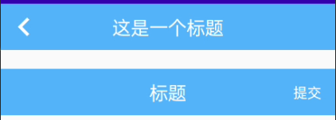

# TitleView 标题控件

### 标题控件继承自 ConstraintLayout 布局，可自由添加所需控件

## 效果图



## 布局文件

- 基本使用

```xml
<com.i56s.ktlib.views.TitleView
    android:layout_width="match_parent"
    android:layout_height="wrap_content"
    android:height="@dimen/dp_50"
    android:background="#4baefe"
    android:text="标题"
    android:textColor="#000000"
    android:textSize="@dimen/sp_15"
    app:addStatusBarHeight="false"
    app:backDrawable="@drawable/ic_title_view_back"
    app:showBack="true" />
```

- 添加控件

```xml
<com.i56s.ktlib.views.TitleView
        android:layout_width="match_parent"
        android:layout_height="wrap_content"
        android:layout_marginTop="20dp"
        app:showBack="false"
        android:text="标题">

        <TextView
            android:layout_width="wrap_content"
            android:layout_height="wrap_content"
            android:layout_marginEnd="15dp"
            android:text="提交"
            android:textColor="@android:color/white"
            android:textSize="15sp"
            app:layout_constraintBottom_toBottomOf="parent"
            app:layout_constraintEnd_toEndOf="parent"
            app:layout_constraintTop_toTopOf="parent" />
</com.i56s.ktlib.views.TitleView>
```

## 自定义属性说明

属性名 | 说明 | 默认值
--- | --- | ---
android:height | 标题高度 | 50dp
android:text | 标题文字 | -
android:textColor | 标题文字颜色 | #FFFFFF
android:textSize | 标题文字大小 | 20sp
android:background | 背景颜色 | #4BAEFE
showBack | 是否显示回退按钮 | true
addStatusBarHeight | 是否添加状态栏高度 | false
backDrawable | 返回按钮图 | drawable/ic_title_view_back

## 监听

```kotlin
//设置返回键点击事件
mBinding.titleView.setOnBackClickListener {
    LogUtils.d("标题", "返回点击")
    true//表示消费事件，点击不会关闭页面
}
//设置标题点击事件
mBinding.titleView.setOnTitleClickListener {
    LogUtils.d("标题", "标题点击")
}
```

## 内置默认属性(可覆盖)

```xml
<style name="TitleView">
        <item name="android:textSize">@dimen/sp_20</item>
        <item name="android:textColor">@android:color/white</item>
        <item name="android:height">@dimen/dp_50</item>
        <item name="android:background">#4baefe</item>
        <item name="backDrawable">@drawable/ic_title_view_back</item>
</style>
```